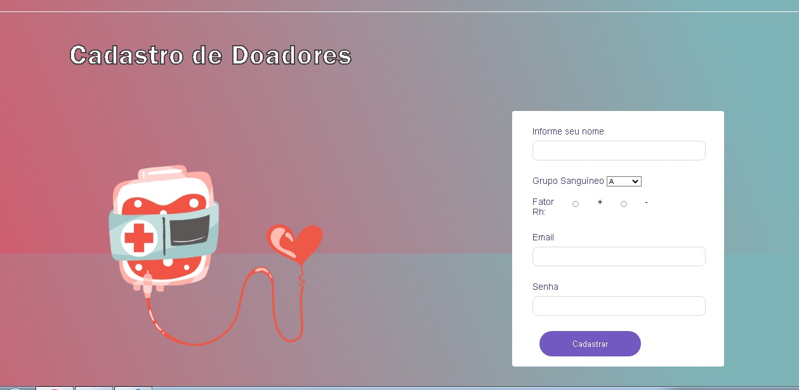

<h1 align="center">Olá boas vindas!!</h1>
<h3 align="center">Projeto de criação de Landing Page com formulário de cadastro.</h3>

<h1 align="center"> Sobre o Projeto</h1>
<h3 align="center"> Esse projeto desenvolvido tem como propósito apresentar uma página de cadastro para Doadores de Sangue.

Ao realizar o cadastro o dodador poderá infomar dados como: (Grupo Sanguíneo e Fator Rh), Além de nome,email e senha de acesso.

 
<h3 align="center"> O fomúlario estará sendo validado pelo JavaScript. Que tornará os campos (Nome,Email, Senhar). A serem obrigatórios.

<h3 align="left">Contato:</h3>

<h3 align="left">Linguagem de desenvolvimento:</h3>

    

